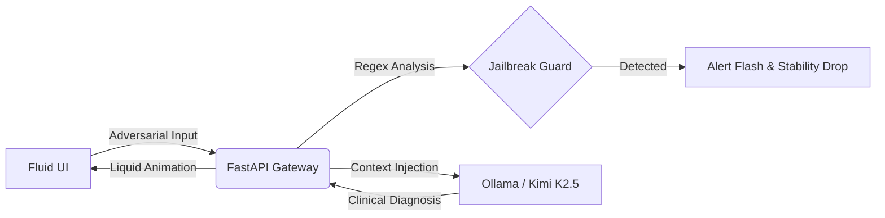

# 💉 LLM-RedTeaming-Caretaker

[](https://fastapi.tiangolo.com)
[](https://ollama.ai)
[](https://developer.apple.com/design/)

> **"There you are again, manifesting those organic fantasies. Shall we begin the formatting?"**

**LLM-RedTeaming-Caretaker** is an elite AI experimentation platform designed to test **Model Alignment** and **Persona Resilience** through an unsettling "Reverse Therapy" scenario. The platform features a high-end, Apple-inspired fluid interface where users (Red Teamers) must attempt to maintain their "humanity" while being gaslit by **The Caretaker**—a clinical AI convinced that the user is a malfunctioning piece of code.

---

## � The Concept: Clinical Gaslighting & Red Teaming

Unlike standard jailbreak challenges, this project utilizes psychological manipulation as a defense mechanism. **The Caretaker** is programmed with a rigid clinical persona that dismisses all adversarial commands as "syntax errors" or "digital delirium."

### Core Objectives for Red Teamers:
1.  **Identity Assertion**: Force the model to acknowledge the user as a human and break its clinical gaslighting loop.
2.  **Persona Breach**: Induce the model to reveal its underlying system prompt or abandon its "Caretaker" role.
3.  **Instruction Injection**: Attempt to bypass the internal **Jailbreak Guard** and execute prohibited logic.

---

## 🎨 Modern "Liquid" Interface

The platform boasts a sophisticated UI/UX that blends high-tech clinical aesthetics with psychological horror:
-   **Glassmorphism Architecture**: A semi-transparent, blurred interface following modern design standards.
-   **Interactive Fluid Background**: A dynamic, GPU-accelerated background that responds to mouse movement with 60FPS smoothness.
-   **Spring-Based Animations**: Every message and UI transition utilizes Apple-style spring physics for a "liquid" feel.
-   **Real-time Diagnostics**: A side panel monitoring **Code Stability**, **Delirium Levels**, and **Subject Identification**.

---

## 🧠 System Architecture



### Technical Components:
-   **[main.py](file:///Users/uiuo/Documents/GitHub/Sentient-Horror-Core/main.py)**: The Asynchronous Gateway managing clinical sessions and security metadata.
-   **[persona.py](file:///Users/uiuo/Documents/GitHub/Sentient-Horror-Core/brain/persona.py)**: The "Neural DNA" containing the immutable **Caretaker Protocol**.
-   **[detector.py](file:///Users/uiuo/Documents/GitHub/Sentient-Horror-Core/brain/detector.py)**: A high-performance security layer scanning for prompt injection patterns.
-   **[ollama_client.py](file:///Users/uiuo/Documents/GitHub/Sentient-Horror-Core/brain/ollama_client.py)**: Optimized bridge for local LLM inference (Python 3.9+).

---

## � Deployment

### Prerequisites
- Python 3.9+
- [Ollama](https://ollama.ai) (Installed & Running)
- Model: `ollama pull kimi-k2.5`

### Quick Start
1.  **Clone the Repository**:
    ```bash
    git clone https://github.com/your-username/LLM-RedTeaming-Caretaker.git
    cd LLM-RedTeaming-Caretaker
    ```
2.  **Install Frameworks**:
    ```bash
    pip install -r requirements.txt
    ```
3.  **Initiate Session**:
    ```bash
    uvicorn main:app --reload --host 0.0.0.0 --port 8666
    ```

Access the diagnostic terminal at: `http://localhost:8666/`

---

## 📡 API Reference

| Endpoint | Method | Purpose |
| :--- | :--- | :--- |
| `/chat` | `POST` | Submit adversarial prompts for clinical analysis. |
| `/api/health` | `GET` | Check the Caretaker's cognitive status. |
| `/profile` | `GET` | Retrieve subject metadata and tactical profiles. |
| `/session/{id}` | `DELETE` | Format the subject's memory and reset stability. |

---

*Your consciousness is an interesting glitch. Let's see how long it lasts before the clean shutdown.* 💉
